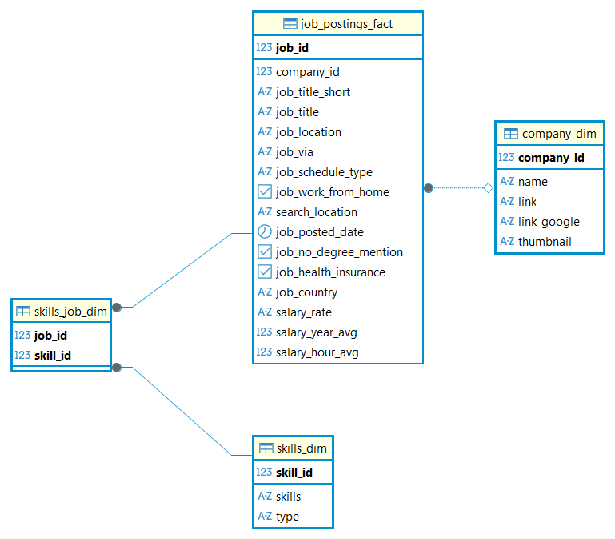
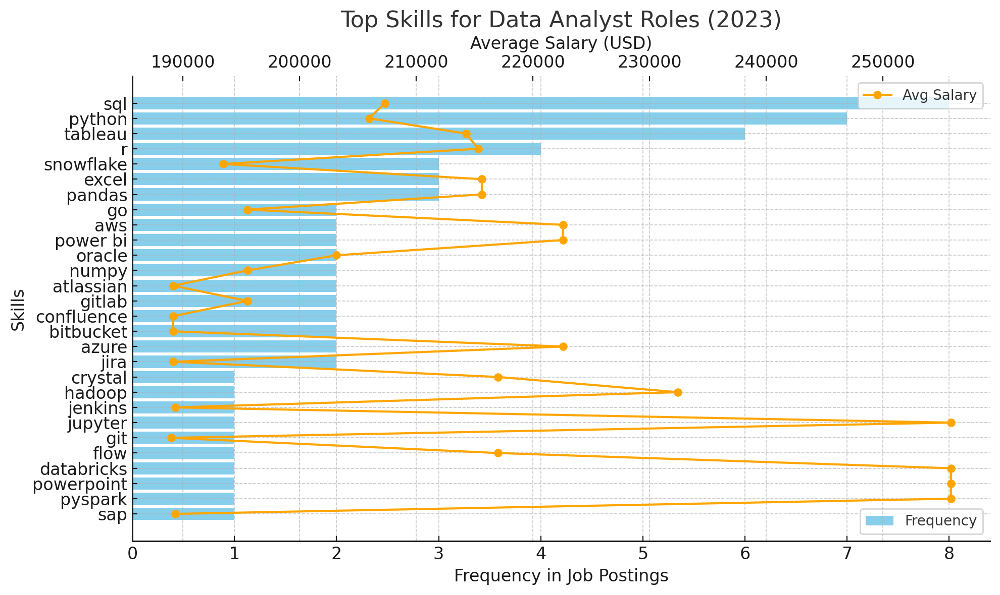
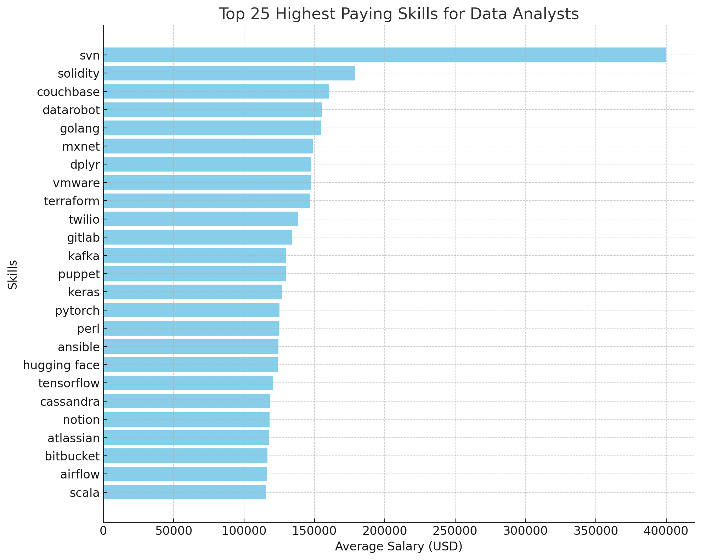

# 1. Introduction

This project presents an end-to-end data analysis of the 2023 jobs database, with a focus on **data analyst roles**. Using real-world job postings, the analysis addresses critical industry questions such as the top-paying positions, essential and in-demand skills, and skillsets that correlate with higher salaries. The project demonstrates how to extract actionable insights from large datasets using SQL within a robust workflow.

## 2. Background

In the contemporary job market, the demand for skilled data analysts is ever-increasing. Companies are looking for professionals with not only strong technical expertise but also competency in specific tools and programming languages. Understanding both compensation trends and skill requirements helps job seekers align their learning with market needs and enables organizations to craft targeted hiring strategies.

### The questions answered through this analysis:

1. What are the top-paying data analyst jobs?
2. What skills are required for these top-paying jobs?
3. What skills are most in demand for data analysts?
4. Which skills are associated with higher salaries?
5. What are the most optimal skills to learn?

## 3. Tools Used

- **PostgreSQL**: Used as the primary database for querying and managing the jobs dataset.
- **Visual Studio Code (VS Code)**: Served as the development environment for writing and executing SQL queries.
- **Git**: Version control

## 4. The Analysis

### Entity Relationship Diagram



***

### 4.1 What are the top-paying data analyst jobs?

To identify the highest-paying roles, I filtered data analyst positions by average yearly salary and location, focusing on remote jobs. This query highlights the high paying opportunities in the field.

```sql
SELECT
    job_id,
    job_title,
    job_location,
    salary_year_avg,
    job_schedule_type,
    company_dim.name AS company_name
FROM
    job_postings_fact
LEFT JOIN
    company_dim
    ON job_postings_fact.company_id = company_dim.company_id
WHERE
    job_title_short = 'Data Analyst' AND
    job_location = 'Anywhere' AND
    salary_year_avg IS NOT NULL
ORDER BY
    salary_year_avg
LIMIT 10;
```
Here's the breakdown of the top data analyst jobs in 2023:
- **Wide Salary Range:** Top 10 paying data analyst roles span from $184,000 to $650,000, indicating significant salary potential in the field.
- **Diverse Employers:** Companies like SmartAsset, Meta, and AT&T are among those offering high salaries, showing a broad interest across different industries.
- **Job Title Variety:** There's a high diversity in job titles, from Data Analyst to Director of Analytics, reflecting varied roles and specializations within data analytics.



***

### 4.2 What skills are required for these top-paying jobs?

This section explores the key skills listed in job postings offering the highest salaries. The output details which proficiencies (e.g., SQL, Python, Tableau, etc.) frequently appear in these top listings.

```sql
WITH top_paying_jobs AS (
    SELECT
        job_id,
        job_title,
        salary_year_avg,
        company_dim.name AS company_name
    FROM
        job_postings_fact
    LEFT JOIN
        company_dim
        ON job_postings_fact.company_id = company_dim.company_id
    WHERE
        job_title_short = 'Data Analyst' AND
        job_location = 'Anywhere' AND
        salary_year_avg IS NOT NULL
    ORDER BY
        salary_year_avg DESC
    LIMIT 10
)
SELECT 
    top_paying_jobs.*,
    skills_dim.skills
FROM top_paying_jobs
INNER JOIN
    skills_job_dim
    ON top_paying_jobs.job_id = skills_job_dim.job_id
INNER JOIN
    skills_dim
    ON skills_dim.skill_id = skills_job_dim.skill_id
ORDER BY
    salary_year_avg DESC
```
Here's the breakdown of the most demanded skills for the top 10 highest paying data analyst jobs in 2023:
- **SQL** is leading with a count of 8.
- **Python** follows closely with a count of 7.
- **Tableau** is also highly sought after, with a count of 6.
Other skills like **R**, **Snowflake**, **Pandas**, and **Excel** show varying degrees of demand.



***

### 4.3 What skills are most in demand for data analysts?

An aggregation of skills required across all data analyst job postings reveals industry demand, helping candidates focus on the most sought-after competencies.

```sql
SELECT
    skills,
    COUNT(skills_job_dim.job_id) AS demand_count
FROM 
    job_postings_fact
INNER JOIN 
    skills_job_dim 
    ON job_postings_fact.job_id = skills_job_dim.job_id
INNER JOIN
    skills_dim
    ON skills_job_dim.skill_id = skills_dim.skill_id
WHERE
    job_title_short = 'Data Analyst'
GROUP BY 
    skills
ORDER BY 
    demand_count DESC
LIMIT 5
```

| Skills   | Demand Count |
|----------|--------------|
| SQL      | 92628        |
| Excel    | 67031        |
| Python   | 57326        |
| Tableau  | 46554        |
| Power BI | 39468        |


Here's the breakdown of the most demanded skills for data analysts in 2023
- **SQL** and **Excel** remain fundamental, emphasizing the need for strong foundational skills in data processing and spreadsheet manipulation.
- **Programming** and **Visualization Tools** like **Python**, **Tableau**, and **Power BI** are essential, pointing towards the increasing importance of technical skills in data storytelling and decision support.

***

### 4.4 Which skills are associated with higher salaries?

Statistical analysis of the relationship between listed skills and offered salaries identifies which skills tend to command premium compensation.

```sql
SELECT
    skills,
    ROUND(AVG(salary_year_avg),0) AS avg_salary
FROM 
    job_postings_fact
INNER JOIN 
    skills_job_dim 
    ON job_postings_fact.job_id = skills_job_dim.job_id
INNER JOIN
    skills_dim
    ON skills_job_dim.skill_id = skills_dim.skill_id
WHERE
    job_title_short = 'Data Analyst'
    AND salary_year_avg IS NOT NULL
GROUP BY 
    skills
ORDER BY 
    avg_salary DESC
LIMIT 25
```
| Skills     | Avg Salary |
|------------|------------|
| svn        | 400000     |
| solidity   | 179000     |
| couchbase  | 160515     |
| datarobot  | 155486     |
| golang     | 155000     |
| mxnet      | 149000     |
| dplyr      | 147633     |
| vmware     | 147500     |
| terraform  | 146734     |
| twilio     | 138500     |

*Table of the average salary for the top 10 paying skills for data analysts*

- Niche & emerging tech pays big – Rare skills like SVN, Solidity, Golang, and blockchain/crypto tools command the highest salaries due to scarcity.

- AI, ML & Big Data expertise is highly rewarded – Frameworks like PyTorch, TensorFlow, MXNet, Hugging Face, plus big data tools like Kafka and Cassandra drive top pay.

- DevOps & cross-domain skills boost value – Terraform, Ansible, GitLab, Airflow, and VMware show that blending data analytics with cloud, automation, and workflow orchestration increases earning potential.

***

### 4.5 What are the most optimal skills to learn?

By intersecting demand and salary data, the analysis pinpoints skills that are both highly sought after and associated with better pay, guiding learning priorities.

```sql
SELECT 
    skills_dim.skill_id,
    skills_dim.skills,
    COUNT(skills_job_dim.job_id) AS demand_count,
    ROUND(AVG(job_postings_fact.salary_year_avg), 0) AS avg_salary
FROM job_postings_fact
INNER JOIN skills_job_dim ON job_postings_fact.job_id = skills_job_dim.job_id
INNER JOIN skills_dim ON skills_job_dim.skill_id = skills_dim.skill_id
WHERE
    job_title_short = 'Data Analyst'
    AND salary_year_avg IS NOT NULL
    AND job_work_from_home = True 
GROUP BY
    skills_dim.skill_id
HAVING
    COUNT(skills_job_dim.job_id) > 10
ORDER BY
    avg_salary DESC,
    demand_count DESC
LIMIT 25;
```
| Skill ID | Skills      | Demand Count | Avg Salary |
|----------|-------------|--------------|------------|
| 8        | go          | 27           | 115320     |
| 234      | confluence  | 11           | 114210     |
| 97       | hadoop      | 22           | 113193     |
| 80       | snowflake   | 37           | 112948     |
| 74       | azure       | 34           | 111225     |
| 77       | bigquery    | 13           | 109654     |
| 76       | aws         | 32           | 108317     |
| 4        | java        | 17           | 106906     |
| 194      | ssis        | 12           | 106683     |
| 233      | jira        | 20           | 104918     |

*Table of the most optimal skills for data analyst sorted by salary*

Here's a breakdown of the most optimal skills for Data Analysts in 2023: 
- **High-Demand Programming Languages:** Python and R stand out for their high demand, with demand counts of 236 and 148 respectively. Despite their high demand, their average salaries are around $101,397 for Python and $100,499 for R, indicating that proficiency in these languages is highly valued but also widely available.
- **Cloud Tools and Technologies:** Skills in specialized technologies such as Snowflake, Azure, AWS, and BigQuery show significant demand with relatively high average salaries, pointing towards the growing importance of cloud platforms and big data technologies in data analysis.
- **Business Intelligence and Visualization Tools:** Tableau and Looker, with demand counts of 230 and 49 respectively, and average salaries around $99,288 and $103,795, highlight the critical role of data visualization and business intelligence in deriving actionable insights from data.
- **Database Technologies:** The demand for skills in traditional and NoSQL databases (Oracle, SQL Server, NoSQL) with average salaries ranging from $97,786 to $104,534, reflects the enduring need for data storage, retrieval, and management expertise.

## 5. Conclusions

This project highlights the importance of aligning job market data with personal learning and development. The findings suggest that:

- Certain data analyst roles offer notably higher compensation, frequently requiring proficiency in advanced analytics tools and programming.
- Skills such as SQL, Python, and Tableau are not only in frequent demand but also tied to higher-paying opportunities.
- Upskilling in both commonly required and high-compensation skills is the most effective path for career advancement in data analytics.

*For detailed results and visualizations, refer to the labeled images in the analysis section.*

***